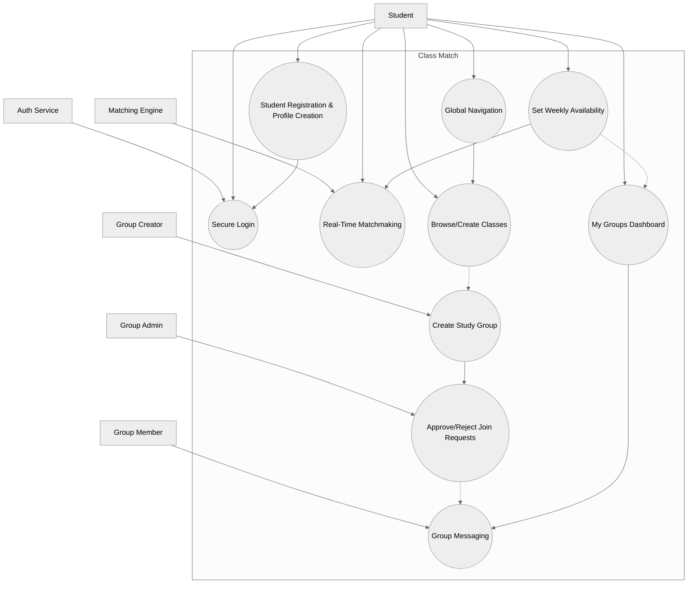

```mermaid
%%{init: {'theme': 'neutral'}}%%
graph TD
    A[Student]
    B[Auth Service]
    C[Matching Engine]
    D[Group Creator]
    E[Group Admin]
    F[Group Member]

    subgraph "Class Match"
        UC1((Student Registration & Profile Creation))
        UC2((Secure Login))
        UC3((Set Weekly Availability))
        UC5((Real-Time Matchmaking))
        UC8((Create Study Group))
        UC11((Approve/Reject Join Requests))
        UC14((Global Navigation))
        UC15((Browse/Create Classes))
        UC17((Group Messaging))
        UC20((My Groups Dashboard))

        UC1 --> UC2:::include
        UC3 --> UC5:::include
        UC8 --> UC11:::include
        UC14 --> UC15:::include
        UC20 --> UC17:::include

        UC15 -.-> UC8:::extend
        UC11 -.-> UC17:::extend
        UC3 -.-> UC20:::extend
    end

    A --> UC1
    A --> UC2
    A --> UC3
    A --> UC5
    A --> UC14
    A --> UC15
    A --> UC20

    D --> UC8
    E --> UC11
    F --> UC17

    B --> UC2
    C --> UC5
```