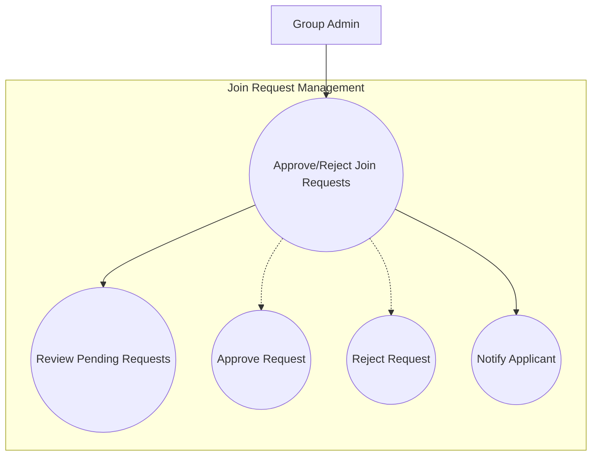

```mermaid
graph TD
    A[Group Admin] --> B((Approve/Reject Join Requests))
    B --> C((Review Pending Requests)):::include
    B -.-> D((Approve Request)):::extend
    B -.-> E((Reject Request)):::extend
    B --> F((Notify Applicant)):::include

    subgraph "Join Request Management"
        B
        C
        D
        E
        F
    end
```