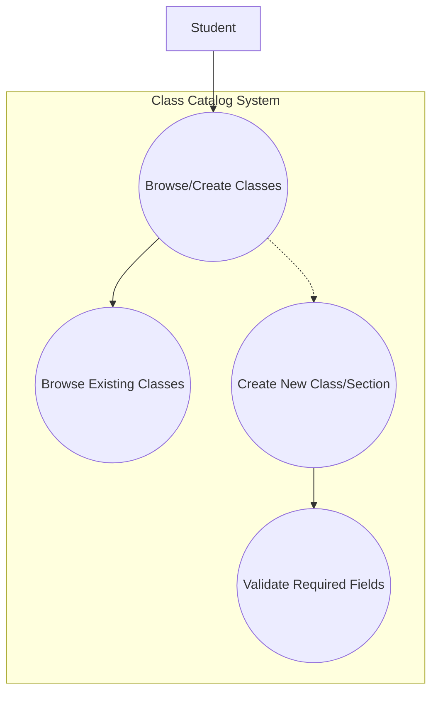

```mermaid
graph TD
    A[Student] --> B((Browse/Create Classes))
    B --> C((Browse Existing Classes)):::include
    B -.-> D((Create New Class/Section)):::extend
    D --> E((Validate Required Fields)):::include

    subgraph "Class Catalog System"
        B
        C
        D
        E
    end
```