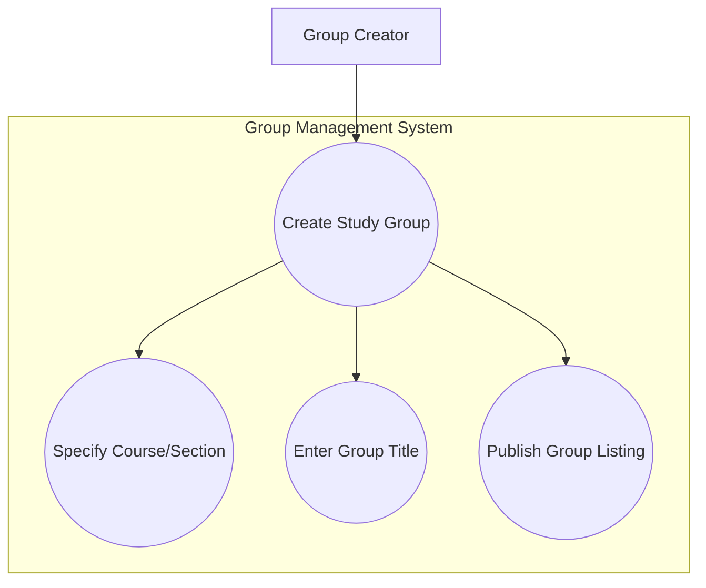

```mermaid
graph TD
    A[Group Creator] --> B((Create Study Group))
    B --> C((Specify Course/Section)):::include
    B --> D((Enter Group Title)):::include
    B --> E((Publish Group Listing)):::include

    subgraph "Group Management System"
        B
        C
        D
        E
    end
```