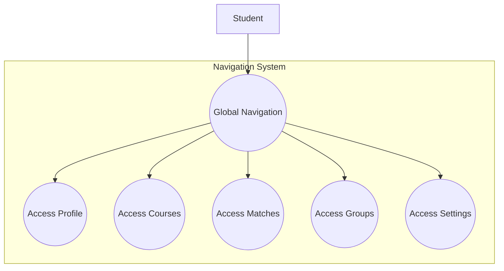

```mermaid
graph TD
    A[Student] --> B((Global Navigation))
    B --> C((Access Profile)):::include
    B --> D((Access Courses)):::include
    B --> E((Access Matches)):::include
    B --> F((Access Groups)):::include
    B --> G((Access Settings)):::include

    subgraph "Navigation System"
        B
        C
        D
        E
        F
        G
    end
```