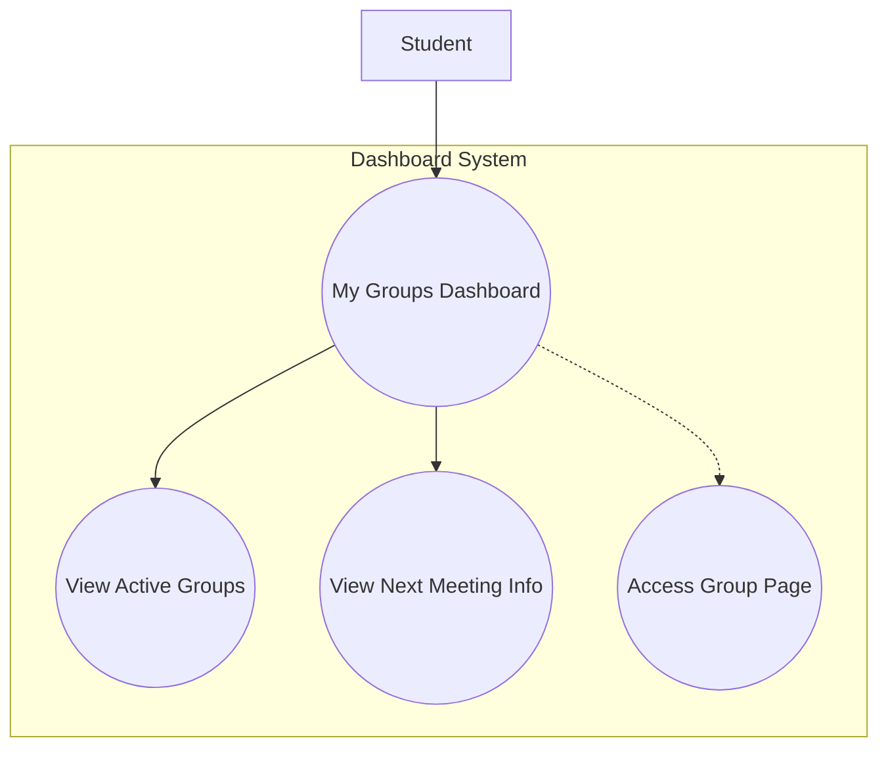

```mermaid
graph TD
    A[Student] --> B((My Groups Dashboard))
    B --> C((View Active Groups)):::include
    B --> D((View Next Meeting Info)):::include
    B -.-> E((Access Group Page)):::extend

    subgraph "Dashboard System"
        B
        C
        D
        E
    end
```