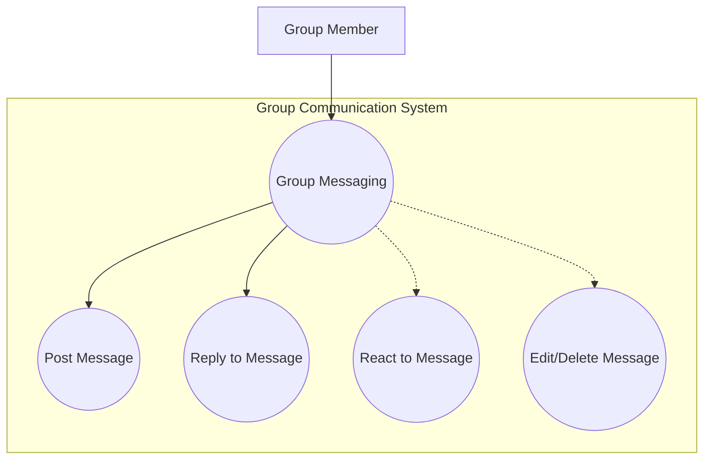

```mermaid
graph TD
    A[Group Member] --> B((Group Messaging))
    B --> C((Post Message)):::include
    B --> D((Reply to Message)):::include
    B -.-> E((React to Message)):::extend
    B -.-> F((Edit/Delete Message)):::extend

    subgraph "Group Communication System"
        B
        C
        D
        E
        F
    end
```