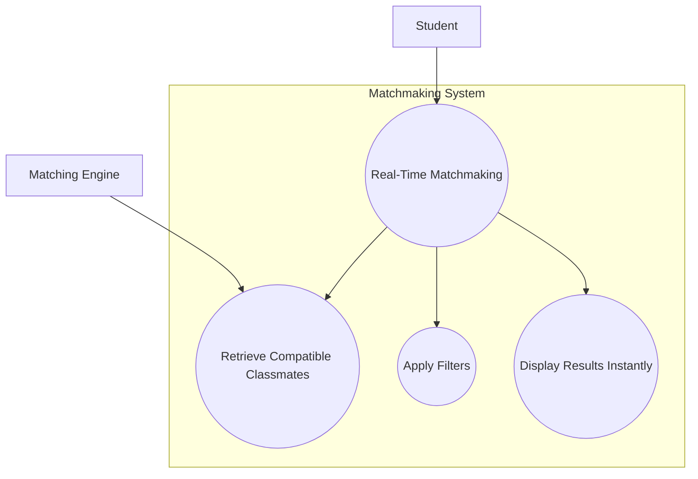

```mermaid
graph TD
    A[Student] --> B((Real-Time Matchmaking))
    F[Matching Engine] --> G((Retrieve Compatible Classmates))
    B --> C((Apply Filters)):::include
    B --> G
    B --> D((Display Results Instantly)):::include

    subgraph "Matchmaking System"
        B
        C
        D
        G
    end
```