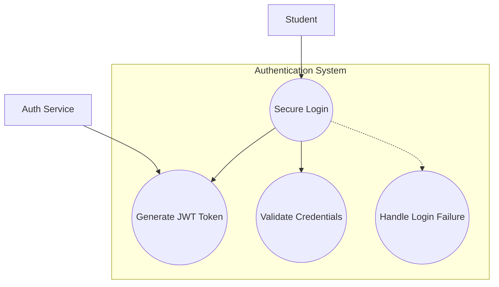

```mermaid
graph TD
    A[Student] --> B((Secure Login))
    F[Auth Service] --> G((Generate JWT Token))
    B --> C((Validate Credentials)):::include
    B --> G
    B -.-> D((Handle Login Failure)):::extend

    subgraph "Authentication System"
        B
        C
        D
        G
    end
```