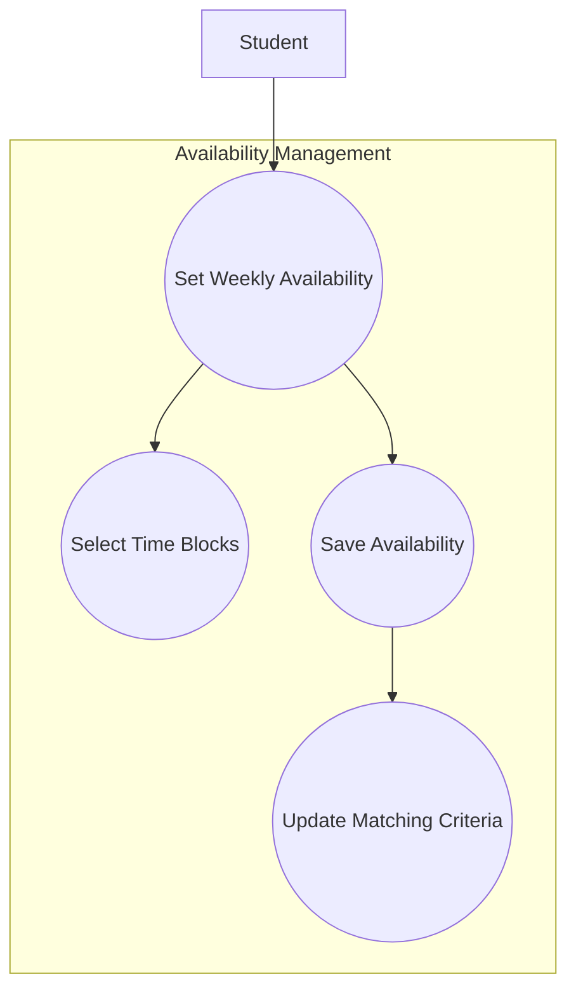

```mermaid
graph TD
    A[Student] --> B((Set Weekly Availability))
    B --> C((Select Time Blocks)):::include
    B --> D((Save Availability)):::include
    D --> E((Update Matching Criteria)):::include

    subgraph "Availability Management"
        B
        C
        D
        E
    end
```