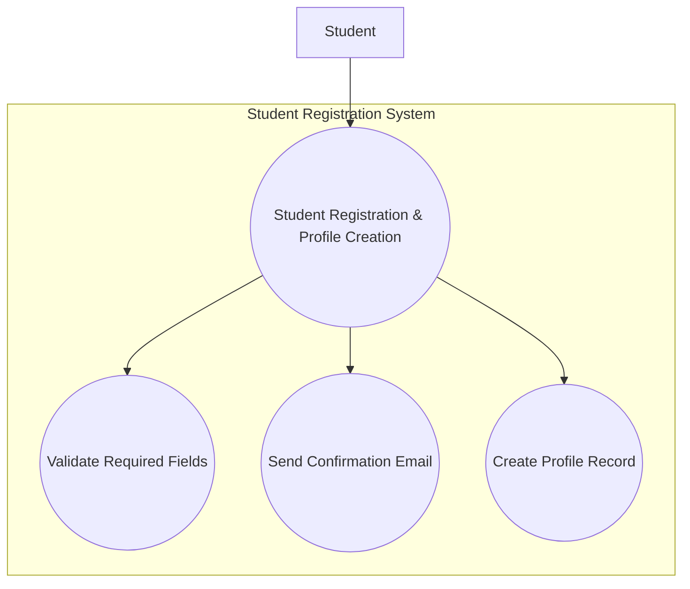

```mermaid
graph TD
    A[Student] --> B((Student Registration & Profile Creation))
    B --> C((Validate Required Fields)):::include
    B --> D((Send Confirmation Email)):::include
    B --> E((Create Profile Record)):::include

    subgraph "Student Registration System"
        B
        C
        D
        E
    end
```